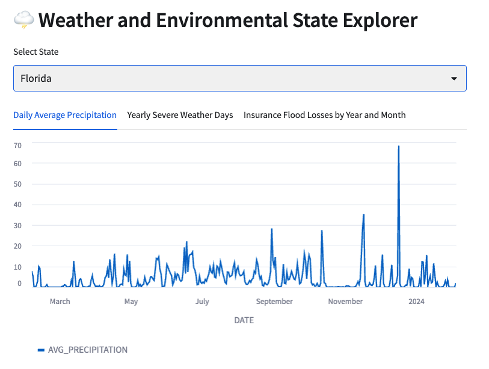
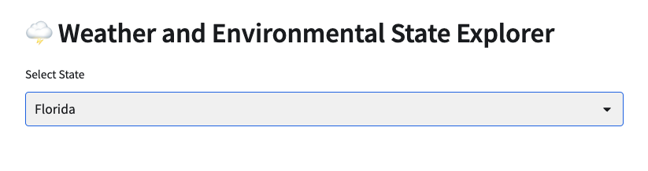

# Streamlit Quickstart
In this Quickstart tutorial, we'll be creating a Streamlit app in Snowflake. We'll use data from the Snowflake Marketplace and build an app to visualize data. We'll build this step by step in the readme file and the full finished code is available in [streamlit_app.py](streamlit_app.py).



## Step 1: Get dataset from the marketplace
We will be using the [Cybersyn Weather & Environmental Essentials](https://app.snowflake.com/marketplace/listing/GZTSZAS2KIM/cybersyn-inc-weather-environmental-essentials?originTab=provider&providerName=Cybersyn%2C%20Inc&profileGlobalName=GZTSZAS2KCS) dataset from the Snowflake Marketplace. This dataset contains weather and environmental data from sources like the National Oceanic and Atmospheric Administration (NOAA), Our World in Data (OWID), the Emissions Database for Global Atmospheric Research (EDGAR), the Food and Agriculture Organization (FAO) of the UN, and the Federal Emergency Management Agency (FEMA). 

To make this free dataset available in your Snowflake acocunt, visit the [Snowflake Marketplace Listing](https://app.snowflake.com/marketplace/listing/GZTSZAS2KIM/cybersyn-inc-weather-environmental-essentials?originTab=provider&providerName=Cybersyn%2C%20Inc&profileGlobalName=GZTSZAS2KCS) and click the blue "Get" button. 

You will be prompted to provide a name for the database and choose which roles to grant access to. For this exercise, we recommend leaving the name of the database as the default "Weather__Environmental_Essentials" and grant access to the role you will be using to create your Streamlit application. 


## Step 2: Create a new Streamlit app
Our Streamlit app will be created using the Snowsight UI web editor. You can also develop Streamlit applications locally and deploy to Snowflake using the [SnowCLI](https://docs.snowflake.com/en/user-guide/snowsql) or by loading the file with the code to a stage and executing the `CREATE STREAMLIT` command ([docs](https://docs.snowflake.com/en/sql-reference/sql/create-streamlit)). 

1. Choose a database where your Streamlit app will be created or create new database. Depending on your privileges, you may need to grant permissions to create a Streamlit app on your database. You can do this by running the command `GRANT CREATE STREAMLIT ON SCHEMA <database_name>.<schema_name> TO ROLE <role_name>`.
2. On the left navigation bar in your Snowflake account, choose "Streamlit." Press the `+ Streamilit App` button to create a new Streamlit app.  Here, you will select the database where you will create your app and the compute warehouse that you will use. 

## Step 3: Editing the Streamlit app
Once you complete Step 2, the editor window will open with a simple example Streamlit app. Delete the existing sample application code and paste the code below. This code imports a helper function to access a Snowpark session that connects to data in your Snowflake account, the Streamlit package, and altair for the creation of some custom charts. 
```
from snowflake.snowpark.context import get_active_session
from snowflake.snowpark.functions import lit, col, date_add, current_date, year, monthname, to_date 
from snowflake.snowpark.types import DecimalType
import altair as alt
import streamlit as st

# Set page config
st.set_page_config(layout="wide")

# Get current session
session = get_active_session()

st.header(":lightning_cloud: Weather and Environmental State Explorer")
```


## Step 4: Our first dataframe and widget
Here we create a function to return a Pandas dataframe with all U.S. state names. We use the `@st.cache_data()` [[docs](https://docs.streamlit.io/library/api-reference/performance/st.cache_data) decorator to cache the returned data, which will improve performance for user interactions. 

We also create our first Streamlit widget. The `selectbox` widget allows the user to select a state to analyze.
```
# load and cache state names
database_name = 'WEATHER__ENVIRONMENTAL_ESSENTIALS'
schema_name = 'CYBERSYN'

@st.cache_data()
def load_states():
    return (session.table(f"{database_name}.{schema_name}.geography_index")
                   .filter(col('LEVEL') == 'State')
                   .select(col('GEO_NAME'))
                   .sort(col('GEO_NAME'))      
            ).to_pandas()

states = load_states()

# create selectbox for user interaction
selected_state = st.selectbox("Select State", states)
```

Paste this code below the `session = get_active_session()` line in your code editor and run your application to refresh. 

## Step 5: Define application datasets
Next we'll define the datasets that we'll use in the visualization. Our `load_data()` has an argument of `filter_state`. This argument is used in the dataset creation. Once again, we use the `@st.cache_data()` [[docs](https://docs.streamlit.io/library/api-reference/performance/st.cache_data) decorator to cache the returned data. This will increase performance in the case of a re-run of the dataset for the same state. 

Note that we're able to create our data extracts using Snowpark dataframes and with SQL.

We'll use the `st.dataframe()` widget to examine and QA our data while we are developing.

Paste the code below after your `selected_state` widget in your code editor.

```
@st.cache_data()
def load_data(filter_state: str):

    # use weather metrics data for daily precipitation
    weather_metrics_ts = session.table(f"{database_name}.{schema_name}.noaa_weather_metrics_timeseries")
    weather_stations = session.table(f"{database_name}.{schema_name}.noaa_weather_station_index")

    metrics_and_stations = (weather_metrics_ts.join(weather_stations, on="noaa_weather_station_id", how="inner")
                                              .filter(col("state_name") == filter_state)
                           )

    daily_precip = (metrics_and_stations.filter(col('VARIABLE') == 'precipitation')
                                        .filter(col('DATE') >= date_add(current_date(), -365))
                                        .group_by(col('DATE'))
                                        .avg(col('VALUE'))
                                        .select(col("DATE"), col('AVG(VALUE)').cast(DecimalType(16,2)).alias('AVG_PRECIPITATION'))
                                        .sort('DATE')
                    )

    #severe weather stats using SQL
    severe_weather = session.sql(f'''SELECT
                                        YEAR(ts.date) AS year,
                                        COUNT(DISTINCT ts.date) AS count_severe_weather_days
                                    FROM {database_name}.{schema_name}.noaa_weather_metrics_timeseries AS ts
                                    JOIN {database_name}.{schema_name}.noaa_weather_station_index AS idx
                                        ON (ts.noaa_weather_station_id = idx.noaa_weather_station_id)
                                    WHERE 
                                        ts.variable_name = 'Weather Type: Tornado, Waterspout, or Funnel Cloud'
                                        AND idx.state_name = '{filter_state}'
                                        AND ts.value = 1
                                        AND ts.date >= '2010-01-01'
                                    GROUP BY year
                                    ORDER BY year
                                ''')
    flood_claim_index = session.table(f"{database_name}.{schema_name}.fema_national_flood_insurance_program_claim_index")
    geo_index = session.table(f"{database_name}.{schema_name}.geography_index").filter(col("geo_name") == filter_state)
    
    insurance_claims = (flood_claim_index
                               .filter(col('DATE_OF_LOSS') >= to_date(lit('2010-01-01')))
                               .join(geo_index, flood_claim_index.state_geo_id == geo_index.geo_id, how="inner")
                               .group_by([year(col("DATE_OF_LOSS")), monthname(col("DATE_OF_LOSS"))])
                               .sum(col('BUILDING_DAMAGE_AMOUNT'), col('CONTENTS_DAMAGE_AMOUNT'))
                               .rename({col('YEAR(DATE_OF_LOSS)'): 'YEAR_OF_LOSS',
                                        col('MONTHNAME(DATE_OF_LOSS)'): 'MONTH_OF_LOSS',
                                        col('SUM(BUILDING_DAMAGE_AMOUNT)'): 'BUILDING_DAMAGE_AMOUNT',
                                        col('SUM(CONTENTS_DAMAGE_AMOUNT)'): 'CONTENTS_DAMAGE_AMOUNT'
                                       })
                                .sort(col("YEAR_OF_LOSS"))
                        )

    return daily_precip.to_pandas(), severe_weather.to_pandas(), insurance_claims.to_pandas()


# Load and cache data
daily_precip, severe_weather, insurance_claims = load_data(selected_state)
```
## Step 5: Create visualizations
Finally, we'll use Streamlit widgets to visualize the data. We'll also use the Streamlit tabs widget to organize our app. Delete the dataframe widgets from the previous section and paste the code below. 

Notice that we're using native Streamlit visualizations for daily average precipitation and yearly severe weather days, but for Insurance Flood Losses we're using an Altair heatmap. This allows us to expand the capabilities of our dashboard with additional visualization types. 
```
daily_precip, severe_weather, insurance_claims = load_data(selected_state)

tab1, tab2, tab3 = st.tabs(['Daily Average Precipitation', 'Yearly Severe Weather Days', 'Insurance Flood Losses by Year and Month' ])

with tab1: 
    st.line_chart(daily_precip, x="DATE")

with tab2: 
    st.bar_chart(severe_weather, x="YEAR", y="COUNT_SEVERE_WEATHER_DAYS")

with tab3: 
    heatmap = alt.Chart(insurance_claims).mark_rect().encode(
                    x=alt.X('YEAR_OF_LOSS:N'),
                    y=alt.Y('MONTH_OF_LOSS:N', sort=['Jan','Feb','Mar','Apr','May','Jun','Jul','Aug','Sep','Oct','Nov','Dec']),
                    color=alt.Color('BUILDING_DAMAGE_AMOUNT:Q', legend=alt.Legend(orient='bottom'))
                )
    
    st.altair_chart(heatmap)
```
