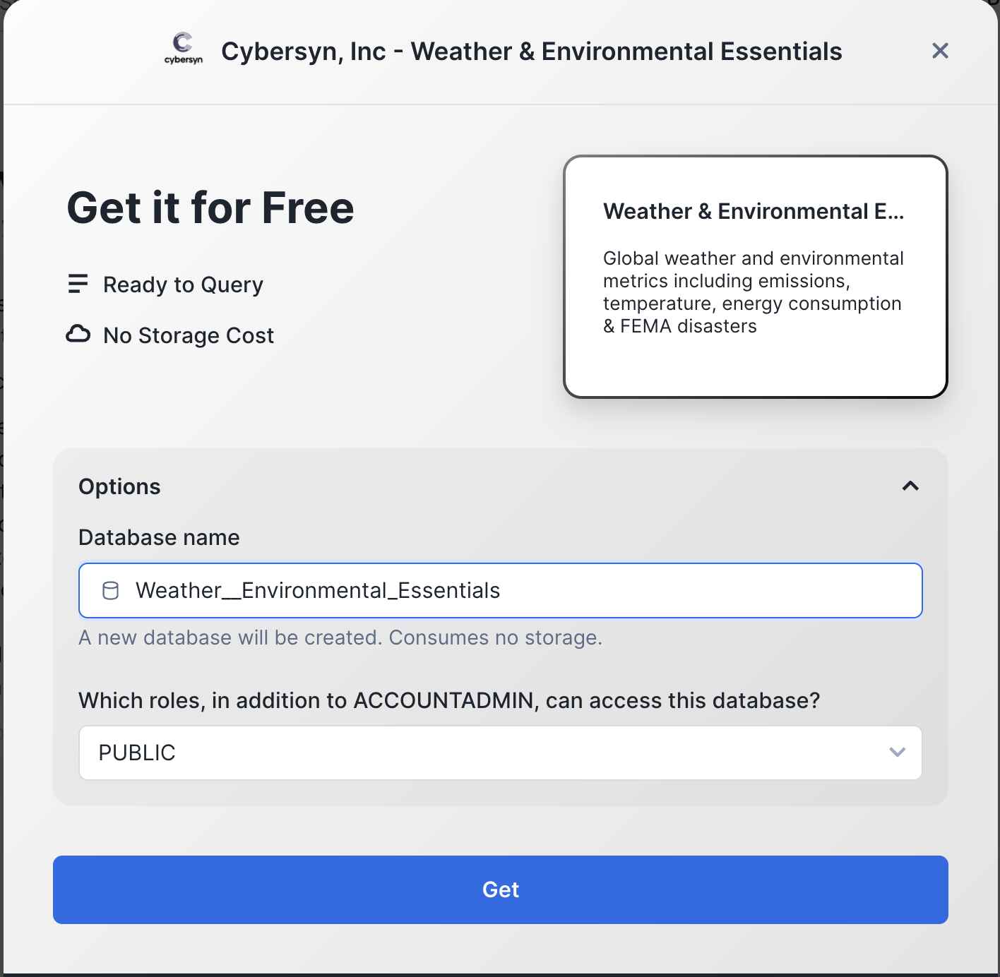
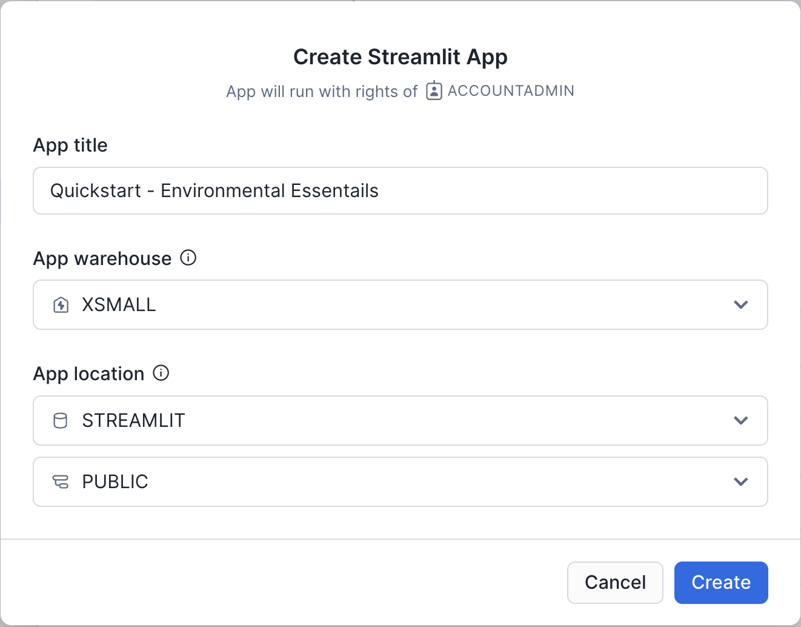

# Streamlit Quickstart

## Step 1: Get dataset from the marketplace
We will be using the [Cybersyn Weather & Environmental Essentials](https://app.snowflake.com/marketplace/listing/GZTSZAS2KIM/cybersyn-inc-weather-environmental-essentials?originTab=provider&providerName=Cybersyn%2C%20Inc&profileGlobalName=GZTSZAS2KCS) dataset from the Snowflake Marketplace. This dataset contains weather and environmental data from sources like the National Oceanic and Atmospheric Administration (NOAA), Our World in Data (OWID), the Emissions Database for Global Atmospheric Research (EDGAR), the Food and Agriculture Organization (FAO) of the UN, and the Federal Emergency Management Agency (FEMA). 

To make this free dataset available in your Snowflake acocunt, visit the [Snowflake Marketplace Listing](https://app.snowflake.com/marketplace/listing/GZTSZAS2KIM/cybersyn-inc-weather-environmental-essentials?originTab=provider&providerName=Cybersyn%2C%20Inc&profileGlobalName=GZTSZAS2KCS) and click the blue "Get" button. 

You will be prompted to provide a name for the database and choose which roles to grant access to. For this exercise, we recommend leaving the name of the database as the default "Weather__Environmental_Essentials" and grant access to the role you will be using to create your Streamlit application. 



## Step 2: Create a new Streamlit app
Our Streamlit app will be created using the Snowsight UI web editor. You can also develop Streamlit applications locally and deploy to Snowflake using the [SnowCLI](https://docs.snowflake.com/en/user-guide/snowsql) or by loading the file with the code to a stage and executing the `CREATE STREAMLIT` command ([docs](https://docs.snowflake.com/en/sql-reference/sql/create-streamlit)). 

1. Choose a database where your Streamlit app will be created or create new database. Depending on your privileges, you may need to grant permissions to create a Streamlit app on your database. You can do this by running the command `GRANT CREATE STREAMLIT ON DATABASE <database_name> TO ROLE <role_name>`.
2. On the left navigation bar in your Snowflake account, choose "Streamlit." Press the `+ Streamilit App` button to create a new Streamlit app.  Here, you will select the database where you will create your app and the compute warehouse that you will use. 

## Step 3: Editing the Streamlit app
Once you complete Step 2, the editor window will open with a simple example Streamlit app. Delete the existing sample application code and paste the code below. This code imports a helper function to access a Snowpark session that connects to data in your Snowflake account, the Streamlit package, and altair for the creation of some custom charts. 
```
from snowflake.snowpark.context import get_active_session
from snowflake.snowpark.functions import sum, col
import altair as alt
import streamlit as st

# Set page config
st.set_page_config(layout="wide")

# Get current session
session = get_active_session()```
